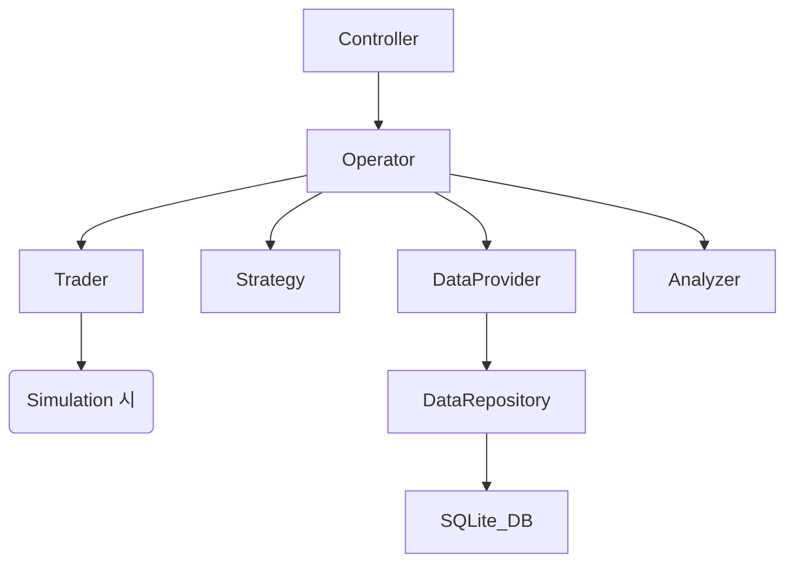

# SMTM (Algorithm-based Crypto Trading System) 프로젝트 상세 분석 보고서

이 프로젝트는 파이썬으로 작성된 알고리즘 기반 암호화폐 자동 매매 시스템입니다. 각 모듈은 인터페이스(추상 클래스)를 통해 정의되어 있으며, 실제 거래소 연동, 시뮬레이션, 머신러닝 전략 등 다양한 구현체를 교체하며 사용할 수 있는 구조입니다.

## 1. 프로젝트 개요 및 아키텍처

- **목표**: 데이터 수집, 전략 실행, 매매, 결과 분석의 자동화 루프 구현.
- **아키텍처**: Layered Architecture. `Operator`가 코어 로직을 관장하고, `Controller`가 사용자 인터페이스를 담당합니다.
- **주요 흐름**: `DataProvider` (데이터 수집) -> `Strategy` (판단) -> `Trader` (실행) -> `Analyzer` (분석) -> 루프 반복.

---

## 2. 모듈별 상세 분석

### 2.1 Core Orchestration (코어 운영)

#### **Operator (`operator.py`, `simulation_operator.py`)**
시스템의 전체 흐름을 제어하는 심장부입니다.

- **`Operator` 클래스**
  - `initialize(data_provider, strategy, trader, analyzer, budget)`: 사용할 모듈들을 주입받아 초기화합니다.
  - `start()`: 매매 루프를 시작합니다. 내부적으로 `Worker`를 통해 비동기 실행됩니다.
  - `stop()`: 매매를 중단하고 최종 리포트를 생성합니다.
  - `_execute_trading(task)`: **핵심 루프**. 데이터를 가져오고, 전략을 업데이트하며, 매매 요청을 생성하여 Trader에게 전달합니다.
  - `get_score(callback, index_info)`: 현재 수익률 정보를 비동기적으로 요청합니다.
- **`SimulationOperator` 클래스**
  - `Operator`를 상속받아 시뮬레이션 환경에 맞춰 `_execute_trading` 로직을 재정의합니다. (예: 게임 오버 조건 처리)

#### **Worker (`worker.py`)**
- **`Worker` 클래스**
  - `post_task(task)`: 스레드 안전한 큐에 작업을 추가합니다.
  - `start()`: 별도의 데몬 스레드에서 큐에 쌓인 작업을 순차적으로 실행하는 루퍼(looper)를 구동합니다.

---

### 2.2 Data Management (데이터 관리)

#### **DataProvider (`data_provider.py` 외)**
데이터 수집을 담당하는 추상 클래스와 구현체들입니다.

- **`DataProvider` (인터페이스)**: `get_info()` 메서드를 통해 'primary_candle' 타입의 데이터를 반환해야 함을 정의합니다.
- **`UpbitDataProvider` / `BithumbDataProvider`**
  - `get_info()`: 각 거래소의 REST API(HTTP GET)를 호출하여 1분/3분/5분 봉 데이터를 가져옵니다.
- **`SimulationDataProvider`**
  - `initialize_simulation(end, count)`: `DataRepository`를 통해 특정 기간의 과거 데이터를 로드합니다.
  - `get_info()`: 로드된 데이터를 한 턴씩 순차적으로 반환하여 시뮬레이션을 진행합니다.
- **`DataRepository` (`data/data_repository.py`)**
  - `get_data(start, end, market)`: SQLite 데이터베이스(`smtm.db`)에서 데이터를 조회하거나, 없을 경우 거래소 API를 통해 가져와 DB에 캐싱합니다.

---

### 2.3 Strategy (매매 전략)

#### **Strategy (`strategy.py` 외)**
매매 결정을 내리는 로직을 포함합니다.

- **`Strategy` (인터페이스)**
  - `update_trading_info(info)`: 새로운 시장 데이터를 전략에 반영합니다.
  - `get_request()`: 현재 전략 상태에 따라 매수/매도/취소 요청을 생성합니다.
  - `update_result(result)`: 매매 체결 결과를 전략의 잔고 및 자산 현황에 반영합니다.
- **`StrategySma0` (SMA 전략)**
  - `SHORT(10)`, `MID(40)`, `LONG(60)` 이동평균선을 산출합니다.
  - **Golden Cross / Dead Cross** 로직을 통해 `buy` 또는 `sell` 프로세스를 결정합니다.
  - 분할 매매(`STEP`) 기능을 지원하여 위험을 분산합니다.

---

### 2.4 Trading & Execution (매매 실행)

#### **Trader (`trader.py` 외)**
실제 또는 가상 주문을 처리합니다.

- **`Trader` (인터페이스)**
  - `send_request(request_list, callback)`: 주문 요청을 보내고 결과를 콜백으로 수신합니다.
  - `get_account_info()`: 현재 잔고와 보유 자산 정보를 반환합니다.
- **`UpbitTrader` / `BithumbTrader`**
  - API Key와 Secret Key를 사용하여 실제 주문(`POST /v1/orders`)을 실행합니다.
- **`SimulationTrader`**
  - 실제 거래소 대신 `VirtualMarket` 객체와 상호작용합니다.
- **`VirtualMarket` (`trader/virtual_market.py`)**
  - **가상 시장 시뮬레이터**. 과거 데이터의 High/Low 가격을 기준으로 주문 체결 여부를 판단합니다.
  - 수수료(`commission_ratio`)를 계산하고 가상 잔고를 관리합니다.

---

### 2.5 Analysis & Reporting (분석 및 보고)

#### **Analyzer (`analyzer.py`)**
투자 성과를 기록하고 시각화합니다.

- **`Analyzer` 클래스**
  - `put_trading_info(info)`, `put_requests(requests)`, `put_result(result)`: 모든 이벤트를 기록합니다.
  - `make_score_record(new_info)`: 누적 수익률과 기초 자산 대비 변동률을 계산합니다.
  - `get_return_report()`: 현재까지의 수익률 요약을 반환합니다.
  - `__draw_graph()`: `mplfinance`를 이용해 OHLC 캔들 차트, 매수/매도 지점, 수익률 곡선이 포함된 JPG 파일을 생성합니다.
  - `create_report(tag)`: 텍스트 형태의 상세 매매 일지와 그래프를 파일로 저장합니다.

---

### 2.6 Control & Interface (인터페이스)

#### **Controller (`controller/` 하위)**
- **`Simulator`**: CLI 기반 인터랙티브 시뮬레이션 제어 (명령어: h, r, s, t, i 등).
- **`TelegramController`**: 텔레그램 봇 API를 사용하여 채팅창에서 명령어를 입력받고 상태를 보고합니다.
- **`MassSimulator`**: 멀티프로세싱(`multiprocessing`)을 활용하여 다양한 파라미터 조합의 시뮬레이션을 동시에 대량으로 실행합니다.

---

### 2.7 Support Modules (지원 모듈)

- **`LogManager`**: `RotatingFileHandler`를 통한 로그 로테이션 지원.
- **`DateConverter`**: ISO8601, Timestamp, 시스템 고유 문자열 간의 날짜 변환 및 시뮬레이션 기간 산출.
- **`Config`**: 시뮬레이션 소스(Upbit/Binance), 로그 레벨 등 전역 설정 관리.

---

## 3. 요약된 클래스 다이어그램 구조 (논리적 관계)

이 상세 분석을 통해 SMTM 프로젝트가 각 기능의 독립성을 보장하면서도 유기적으로 결합되어, 확장이 용이하고 테스트 가능한 구조를 갖추고 있음을 알 수 있습니다.
